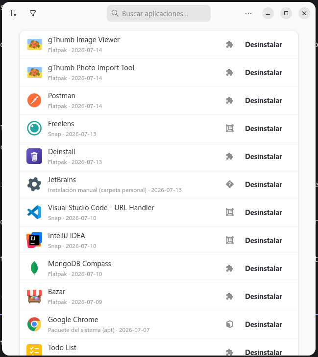

# Deinstall

`Deinstall` is a GTK4/libadwaita app that lists every application installed on
your system — apt, snap, Flatpak, or AppImage — and lets you uninstall it
cleanly from one place, without having to guess which package manager owns it.



Works together with the [Deinstall GNOME Shell extension](https://github.com/pabmartine/deinstall),
which adds an "Uninstall" item to each app's context menu and activates this
app (via D-Bus) focused on that specific app. The extension requires this
app to be installed to do anything.

## Main Features

- **Unified Application List**: Scans every installed application across sources
  and shows them in a single list, each with its icon, name, install date, and a
  badge for the package manager that owns it.
- **Automatic Origin Detection**: Identifies whether each app came from **apt**
  (system package), **Snap**, **Flatpak**, or an **AppImage**, and flags apps it
  can't attribute to a package manager (manual installs under your home folder or
  `/opt`, web apps, and unidentified binaries).
- **One-Click Uninstall**: Removes any app with a single click and a confirmation
  dialog tailored to its origin — Flatpak also clears its user data, apt/Snap
  prompt for administrator authentication, and manual installs are moved to the
  trash so a wrong guess can be recovered.
- **Base-System Safeguards**: Warns before removing packages that are part of the
  base system, where uninstalling could break your desktop or other software.
- **Search, Sort & Filter**: Search applications (Ctrl+F), sort by name or install
  date, and filter by scope (all applications, user-installed, or system).
- **Launcher Deduplication**: Collapses multiple `.desktop` launchers that belong
  to the same underlying app, while keeping genuinely duplicated installs (e.g. a
  Snap *and* an apt build) visible so you can clean them up.
- **Extension Integration**: Can be activated over D-Bus by the companion GNOME
  Shell extension to open directly on a specific app's uninstall dialog.
- **Asynchronous Scanning**: Detects origins in the background so the UI stays
  responsive and hands over an already fully populated list.
- **Localization**: Translated into 10 languages — English, Spanish, German,
  French, Italian, Portuguese, Russian, Chinese, Japanese, and Hindi.
- **Flatpak Packaging**: Fully compilable and installable as a Flatpak bundle.

## Requirements

- Python 3.10+
- GTK 4
- libadwaita 1
- PyGObject

## Running from source

```bash
python3 -m pip install -e .
python3 -m deinstall.main
```

## Building the Flatpak

```bash
./build-flatpak.sh
```

## Screenshots

### Application List

