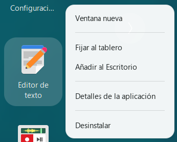

# Deinstall (GNOME Shell extension)

Adds an **Uninstall** item to the right-click menu of every icon in the GNOME
app grid. Clicking it hands the selected app to the companion
[Deinstall app](https://github.com/pabmartine/deinstall-app), which detects
whether the app came from apt, Snap, Flatpak, or an AppImage and removes it
cleanly.



## How it works

The extension is deliberately thin: it does **no** detection and **no**
uninstalling itself. On click it activates the companion app over the session
bus (`org.gtk.Actions` on `com.pabmartine.Deinstall`, exported automatically
because the app is `DBusActivatable`), passing the app's `.desktop` path. All
origin detection and the privileged apt/Snap removal live in the companion app.

Keeping it this thin is what makes it publishable on
[extensions.gnome.org](https://extensions.gnome.org): it never spawns
subprocesses, reads no files beyond what `Shell.App` already exposes, and only
talks to the companion app over D-Bus.

The **Uninstall** item appears on application icons that use the shell's
standard app icon — the app grid, as well as docks that build on it such as
Dash to Dock and Ubuntu Dock — and only for apps that have a `.desktop`
launcher. If the companion app isn't installed, clicking it shows a
notification instead.

## Requirements

- GNOME Shell 45–50
- The [Deinstall app](https://github.com/pabmartine/deinstall-app)
  (`com.pabmartine.Deinstall`) — the extension does nothing without it.

## Install

Copy the extension into your local extensions directory and enable it:

```bash
mkdir -p ~/.local/share/gnome-shell/extensions/deinstall@pabmartine.com
cp -r . ~/.local/share/gnome-shell/extensions/deinstall@pabmartine.com/
gnome-extensions enable deinstall@pabmartine.com
```

Then reload GNOME Shell (log out and back in on Wayland, or `Alt`+`F2` → `r` on
X11) and enable the extension from the Extensions app if needed.

## Localization

Translated into 10 languages — English, Spanish, German, French, Italian,
Portuguese, Russian, Chinese, Japanese, and Hindi.
